```{r setup, include=FALSE}
knitr::opts_chunk$set(message=FALSE, warning=FALSE, echo=TRUE,
                      fig.width = 10,
                      fig.height = 5,
                      comment = "#>",  
                      collapse = TRUE)
```
## Module Overview

Follow along at [rpubs.com/adamsmith_fws/GTW_raster](http://rpubs.com/adamsmith_fws/GTW_raster)

- Use and benefits of R as a GIS tool
- Basic I/O operations with raster (and vector)
- Basic raster operations/conversions
- Simple raster calculations
- Raster &harr; vector conversion
- Some raster/vector interactions

**Prerequisites**

- Comfortable working in R  
- Some experience with raster (and vector)

## Acknowledgments

This material represents a conglomeration of original material as well as parts adapted from:
  
- Wageningen UR's [Geoscripting workshop](https://geoscripting-wur.github.io/)
- NEON's [Data Tutorial Series](http://neondataskills.org/tutorial-series/)
- Robert Hijmans's [`raster` package vignette](https://cran.r-project.org/web/packages/raster/raster.pdf)

Today's module is by no means comprehensive.  

Additional resources:
- [Applied Spatial Data Analysis with R](http://www.springer.com/us/book/9781461476177)
- [CRAN Task View: Analysis of Spatial Data](https://cran.r-project.org/web/views/Spatial.html)

# Why R for Spatial Analysis? | An Example

## These are ducks

<div class="centered">
  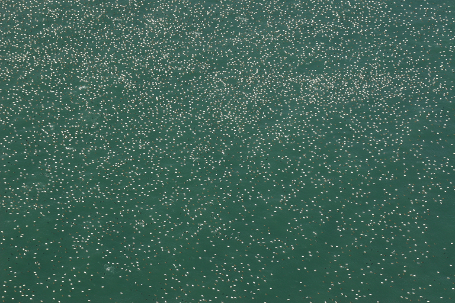
</div>

## This is Nantucket Sound (MA)

<div class="centered">
  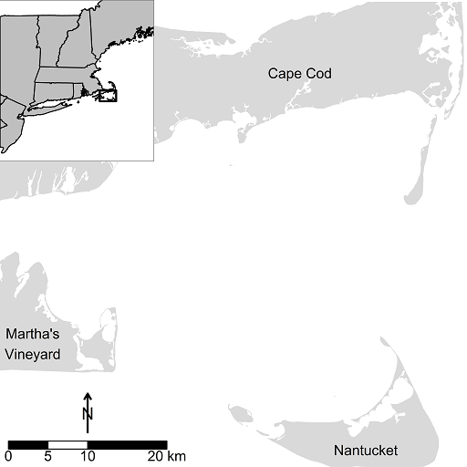
</div>

## This is Horseshoe Shoal

<div class="centered">
  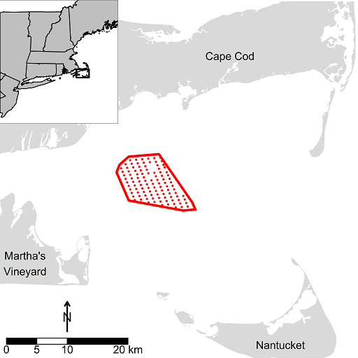
</div>

## The Issue 

- Sea ducks like Nantucket Sound in winter

> - Sea ducks can be displaced by wind energy facilities (Europe)

> - Are sea ducks using Horseshoe Shoal?

> - Enter spatial analysis...

## Step 1: Count the Birds

<div class="centered">
  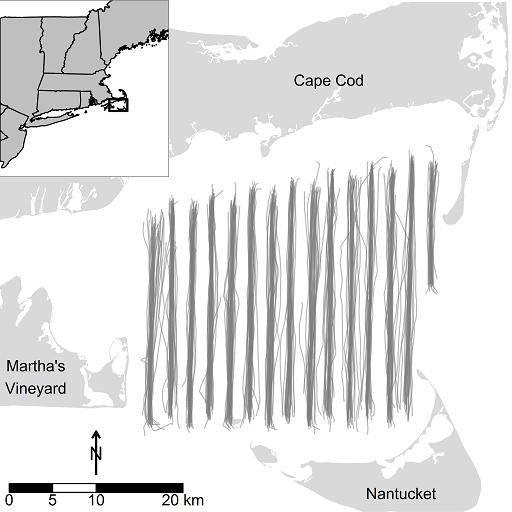
</div>

## Step 1: Count the Birds

<div class="centered">
  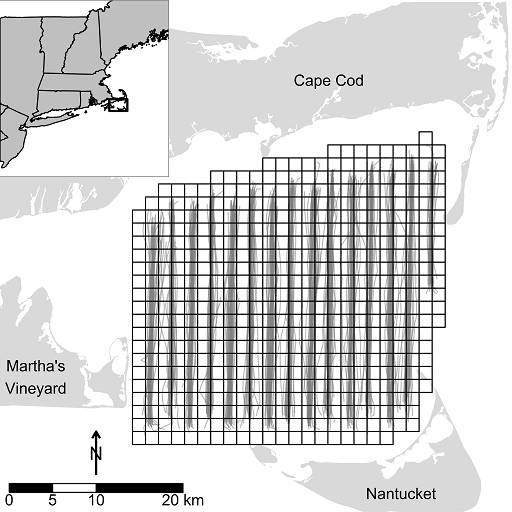
</div>

## Step 2: Quantify Biophysical and Spatiotemporal Associations {.build}

<div class="centered">
  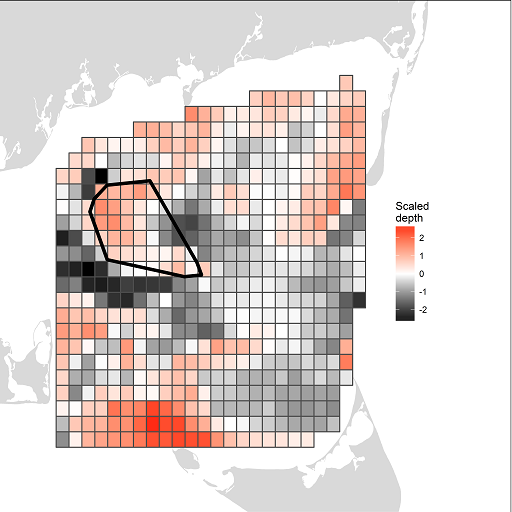
</div>

## Step 2: Quantify Biophysical and Spatiotemporal Associations 

<div class="centered">
  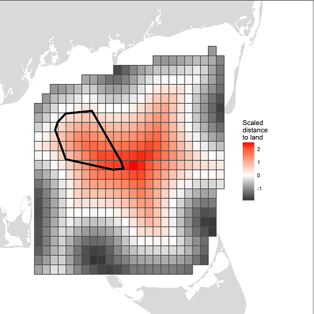
</div>

## Step 2: Quantify Biophysical and Spatiotemporal Associations 

<div class="centered">
  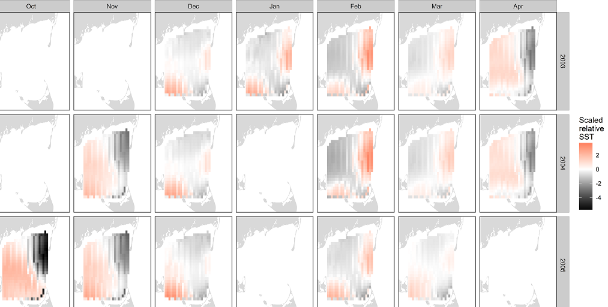
</div>

## Why R for spatial analysis?

- Free and open source
- Active development &rarr; packages
- Active user community: > 2 million worldwide
- Integrated analysis chain from download to analysis
- Makes work reproducible
    - promotes collaboration
    - informs your future self
- Implement complex and custom made algorithms and functions
    - automation
- Explore your data in all its dimensions

# R Data Types

## Object assignment (variables)
- Left-facing arrow (`<-`) or equals sign (`=`)

```{r}
a_number = 3
a_number

a_string <- "NCTC" 
a_string
```  

## Common data types
- `numeric`, `character` (string), and `logical` (TRUE/FALSE)

```{r}
is.numeric(a_number)
class(a_string)

# To specify an integer (default = numeric), use `L` after the number
an_integer <- 5L
class(an_integer)

a_logical <- TRUE
class(a_logical)
```

## Additional data types
- `factor` (another way of storing character data; categorical data)

```{r}
a_factor <- factor(c("Each", "unique", "string", "will", "be", "a", "level"))
str(a_factor)
levels(a_factor)
```  

- `Dates` (another time maybe...)
    - [`lubridate`](https://cran.r-project.org/web/packages/lubridate/index.html) package makes this considerably easier  

## Missing Data

- `NA`
    - used as you might expect; data is defined but missing

```{r}
bird_counts <- c(1, 5, NA, 8, NA)
bird_counts
```
    
- `NULL`
    - absence of anything; undefined
    - commonly used as default for optional function parameters

```{r}
bird_counts <- c(1, 5, NULL, 8, NULL)
bird_counts
```

# Data Structures

## Vectors
- 1D; can hold `numeric`, `character`, or `logical` data
- single data type
    
```{r}
eg <- c("This", "is", "a", "character", "vector")
eg
eg2 <- c(1, 2, 3, 4, 5, 6, 7)
eg2
is.vector(eg)
is.vector(eg2)
```

## Matrices
- `numeric` vector stored in 2 dimensions, rows & columns (e.g., x-y direction)
- single-band rasters (with addn'l spatial metadata)

```{r}
data <- rnorm(8) # `rnorm` generates random normal deviates; see `?rnorm`
mat <- matrix(data, nrow = 2, ncol = 4)
mat
is.matrix(mat)
```

## Data Frames
- 2D (rows and columns); most common data structure
- **each column** is a distinct vector (*cf* matrices); all columns *same* length
- mixed data types allowed

```{r}
# By default, R coerces character vectors to factors
df <- data.frame(char = c("a", "b"), num = rnorm(2), stringsAsFactors = FALSE)
df
str(df) # `str` is a useful function for exploring the structure of an object
```

## Arrays

- `numeric` vector stored in 1 or more dimensions (`dim` argument, see below)
- multi-band rasters (& spatial metadata)

```{r}
arr <- array(rnorm(8), dim = c(2, 2, 2))
arr
```

## Lists

- containers for any combination of objects or data structures

```{r}
lst <- list(eg, mat, df, arr, list(eg, eg2))
str(lst) 
```

## Navigating files in R

- Pathnames are character strings
    - single (`'single'`) or double (`"double"`) quotes work

> - Pathnames in R require forward slashes `/`  
>      - `"C:/This/pathname/is/formatted/correctly.txt"`
    
> - Working directory (i.e., your current location)
>      - view with `getwd()`
>      - change with `setwd()`
    
> - Using pathnames relative to the working directory
>      - current directory denoted with a single period `.`; `setwd("./data")`
>      - go back a directory with two periods `..`; `setwd("..")`

## Getting Help in R

- `?function` will give you the associated help page (`?proj4string`)
- `example(function)` runs an example(s) of the function, if available
- `??searchterm` searches in all packages on CRAN (`??spTransform`)
- [rseek.org](http://rseek.org) is the R Google
- [Google](http://www.google.com) your error message with package ("Failure during raster IO" raster R)
- Search tags in [Stack Overflow](http://stackoverflow.com/) (e.g., [R] [raster] [projection])
- [StackExchange](http://stats.stackexchange.com): like Stack Overflow but for statistics 
- [Crantastic](http://crantastic.org): search through packages on CRAN 

## RStudio (Integrated Development Environment)

- [too many conveniences to list...](http://www.rstudio.com/wp-content/uploads/2016/01/rstudio-IDE-cheatsheet.pdf)
- R Projects

<div class="centered">
  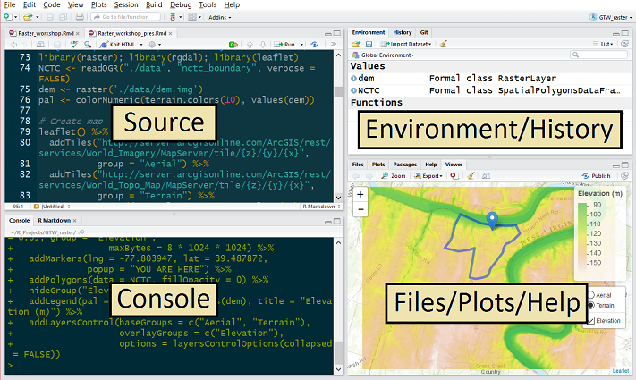
</div>

## Hands On #1: Easing into R
<div id="handson" markdown="1">
1. In R Studio, create an R Project for today's module
    - `File` &rarr; `New Project...` &rarr; `Existing Directory` &rarr; `Create Project`
2. Explore help files (e.g., `?c`, `?vector`, `?list`)
3. Create `numeric` and `character` vectors; store in a `data.frame`
4. Create a `list` of multiple `data.frame`s
5. Experiment with relative pathnames
    - change working directory to `data` folder: `setwd("relative/path")`
    - view list of files: `list.files()`
    - return working directory to the `GTW_raster` folder
</div>

----

## Get R Code used in this module

Assuming you're still in the `GTW_raster` working directory, type:

```{r, eval = FALSE}
dir.create("./R") # Creates new directory
download.file("", destfile = "./R/GTW_raster.R")
download.file("", destfile = "./R/utils.R")
```

# R for Spatial Analysis
 
## System Architecture
<div class="centered">
  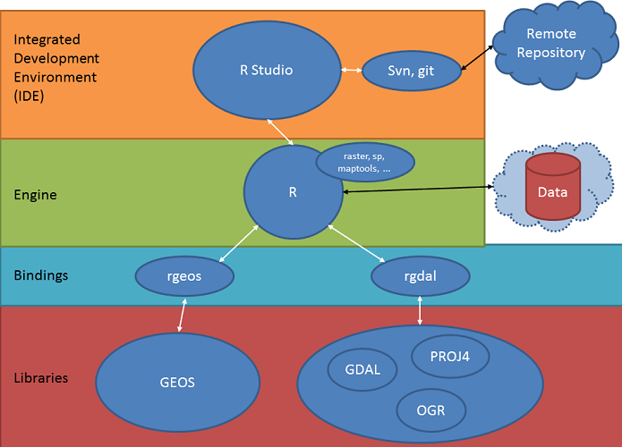
</div>

## Raster data

- Divides space in cells (pixels; rectangles) of equal size
    - for a given coordinate reference system (CRS)
- Can represent continuous or categorical data
    - examples?

<div class="centered">
  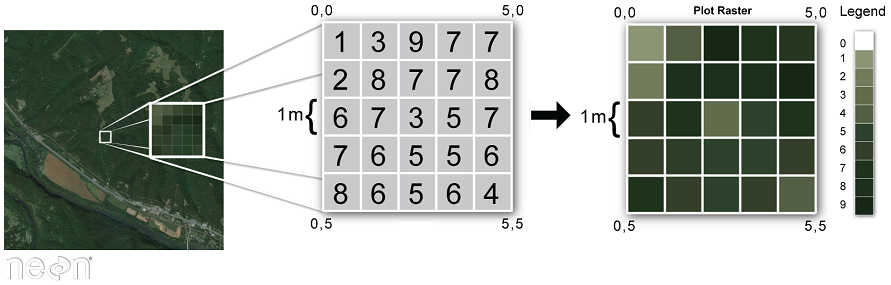
</div>

## Rasters in R

- Classes and methods provided by `raster` package
- Variety of raster file formats
    - GeoTiff, Ascii, netCDF, Erdas Imagine, ENVI, etc.

> - `raster` distinguishes three types of `Raster*` objects
>      - `RasterLayer`: single-layer (band) raster
>      - `RasterStack`: multi-layer raster (one or more files)
>      - `RasterBrick`: multi-layer raster (single file)

> - `RasterStack`layers must have **same extent and resolution**
> - Expect to work on layers separately? `RasterStack`  
> - Calculations on all layers? `RasterBrick`

## Getting raster data into (and out of) R

- create your own 
    - handy when your testing out custom functions, etc.
```{r, eval = FALSE}
r <- raster(ncol = 50, nrow = 50)
```

- main raster reading commands correspond to `Raster*` objects:
    - `raster()`, `stack()`, and `brick()`
- writing raster objects to file uses `writeRaster()`

## Read and inspect our first raster

Load DEM (elevation) for NCTC area
```{r}
library(raster)                 # Need to load `raster` package first
dem <- raster("./data/dem.img") # Single-layer raster, so we use `raster()` function
dem                             # Nice summary of object structure by simply printing it

# Plot methods also exist for raster objects
# plot(dem)

# Use `writeRaster()` to write this object to a new file (e.g., after some transformation)
# The datatype argument is optional but can make a difference with larger rasters; see ?dataType
writeRaster(dem, filename = "./data/new_dem.img", datatype = "INT2U", overwrite = TRUE)
```

## Spatial Metadata

Key metadata for raster data includes:

1. **Object Type**: the class of the object
2. **Coordinate Reference System (`CRS`)**: the projection of the data
    - unprojected (i.e., latitude/longitude) vs. projected (e.g., UTM)
3. **Extent**: the spatial extent (geographic area covered) of a raster in CRS
4. **Resolution**: cell/pixel size in CRS units

We can view/extract this metadata with `class()`, `crs()`, `extent()`, and `res()`, respectively

**NOTE**: these methods (except `res()`) will also apply to vector data

## Closer inspection of raster spatial metadata

```{r}
crs(dem)                        # CRS/projection

extent(dem)                     # Spatial extent

res(dem)                        # Resolution (cell dimensions in CRS units)
```

## Hands On #2: Load Required R Packages
<div id="handson" markdown="1">
- Raster data: `raster` and `rasterVis`
- Vector data: `rgdal` and `sp`
- Install with `install.packages("package name")`
- Load functionality with `library()` or `require()`

```{r packages, message = FALSE, warning=FALSE}
# These packages should all be installed on your machine
library(rgdal)        # R bindings for the Geospatial Data Abstraction Library    
library(raster)       # Primary package for working with rasters in R
# library(sp)         # For vector data/shapefiles; loaded with raster package
library(rasterVis)    # Some handy visualization functions for raster data
library(dplyr)        # Handy tools for data manipulation
```
</div>

## Hands On #3: Load in more NCTC Raster* objects
<div id="handson" markdown="1">
1. Load the DEM raster and 3 additional raster files
    - NAIP_CIR_NE.tif & NAIP_CIR_NW.tif (4-band color infrared photos)
    - WV_habitat.img (single-layer land cover classification)
2. Check the object type, CRS, spatial extent, and resolution
3. Consider the following as you read in these files:
    - which read function is the most appropriate?
    - are CRS and extent the same?

**Helpful hints**:  
- raster files are located in the `data` directory
- assign raster objects names that you'll remember
</div>


## Vector data

- Discrete spatial data (points, lines, polygons)
- Think `shapefile` with/without attributes

<div class="centered">
  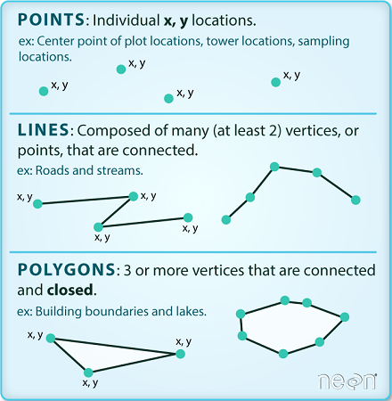
</div>
  
## Vector data

- Classes and methods provided by `sp` package
- Variety of vector file formats (e.g., ESRI Shapefiles, kml)
- Geometries operations (buffering, overlaying, area calculations, etc.)
    - `rgeos` package &rarr; bindings to **Geometry Engine Open Source** library

> - Focus on a few `Spatial*` objects
>      - `SpatialPoints*`
>      - `SpatialLines*`
>      - `SpatialPolygons`
> - Each `Spatial*` class can be associated with attribute data
>      - e.g., `SpatialPolygonsDataFrame`

## Import Data Tables

- *easiest* import format is plain text, especially CSV (`read.table` or `read.csv`)
    - R imports as a `data.frame` by default
- many other options
    - R's native structure (see `?save`)
    - databases (MySQL, SQLite, Access)
    - Excel, SAS, SPSS, DBF, etc.

## Example CSV import

```{r}
download.file(url = "http://tinyurl.com/testCSV", destfile = "./data/test.csv")
test <- read.table("./data/test.csv", header = TRUE, sep = ",")
test <- read.csv("./data/test.csv", header = TRUE)
class(test)
glimpse(test)
```

## Vector data

- Discrete spatial data (points, lines, polygons)
- Think `shapefile` with/without attributes

<div class="centered">
  
</div>
  

## Examine loaded shapefile

```{r, eval=FALSE}
# View description. Note the coordinate bounding box and projection info
summary(wv)
# just look at projection
proj4string(cp.poly)
# make a simple plot
plot(cp.poly, axes=T, col='blue', main = "CO Plateau")
```

:

```{r view-metadata, eval=FALSE }
# view just the class for the shapefile
class(aoiBoundary_HARV)

# view just the crs for the shapefile
crs(aoiBoundary_HARV)

# view just the extent for the shapefile
extent(aoiBoundary_HARV)

# view all metadata at same time
aoiBoundary_HARV
```

download.file(url = 'https://raw.githubusercontent.com/adamdsmith/GTW_raster/master/test_script.R', destfile = 'downloadOK.R', method = 'auto')
